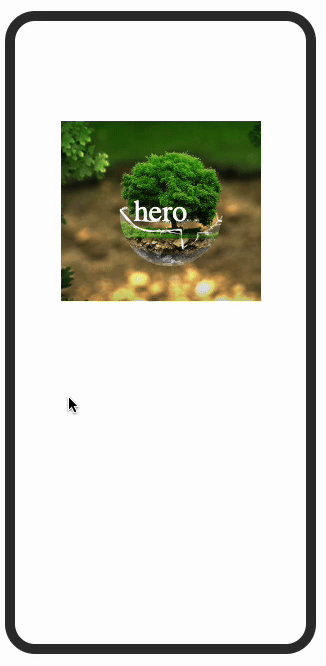

# React Hero Animation

React Hero Animation works with position "fixed" regardless of the element's location.
Note: the package is not ready yet

## Install

```bash
npm install react-hero-animations-not-ready
```

```bash
yarn add react-hero-animations-not-ready
```

## Demo



## Github Pages

[Github Pages](#)

## CodeSandbox

[Sandbox](#)

## Example Usage

```jsx
import React, { Component } from "react";

import { MetroTabs, MetroTab } from "react-metro-tabs";

export default function App() {
  return (
    <Hero>
      <HeroItem>
        <div>Hero</div>
        <HeroContent>
          <div>Content</div>
        </HeroContent>
      </HeroItem>
    </Hero>
  );
}
```

## Hero props

| Prop               | Type | Description | Default |
| ------------------ | ---- | ----------- | ------- |
| controlled         |      |             |         |
| wrapperRef         |      |             |         |
| transitionDuration |      |             |         |
| open               |      |             |         |
| setOpen            |      |             |         |
| related            |      |             |         |
| onTabChange        |      |             |         |
| targetHeight       |      |             |         |
| children           |      |             |         |

## HeroItem props

## HeroContent props

## License

The source code is licensed under MIT, all assets are copyrighted to their respective owner.
